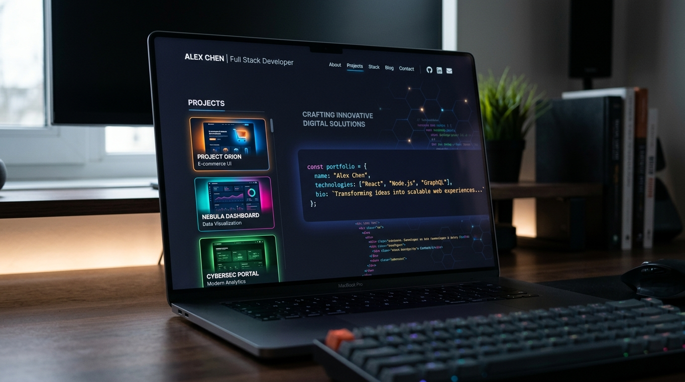

# Personal Developer Portfolio

A modern, responsive personal portfolio website designed to showcase my skills, projects, and professional experience. Built with a focus on clean aesthetics, smooth animations, and an intuitive user experience.



## 🚀 Live Demo

[View Live Portfolio](https://swati-portfolio-sigma.vercel.app)

## ✨ Features

- **Modern Tech Stack**: Built with React (Vite), TypeScript, and Tailwind CSS.
- **Smooth Animations**: Powered by Framer Motion for scroll reveals and page transitions.
- **Dark/Light Mode**: Fully functional theme toggler with persistent state.
- **Developer-Centric UI**: Includes a custom Command Palette (`Ctrl+K` / `Cmd+K`) for quick navigation.
- **Responsive Design**: Mobile-first approach ensuring a seamless experience across all devices.
- **Working Contact Form**: Integrated with FormSubmit for direct email messaging without a backend.
- **Custom Cursor**: Interactive custom cursor for a polished feel.

## 🛠️ Tech Stack

- **Framework**: [React 18](https://react.dev/) + [Vite](https://vitejs.dev/)
- **Language**: [TypeScript](https://www.typescriptlang.org/)
- **Styling**: [Tailwind CSS](https://tailwindcss.com/)
- **Animations**: [Framer Motion](https://www.framer.com/motion/)
- **Icons**: [Lucide React](https://lucide.dev/)

## 🏃‍♀️ Getting Started

To run this project locally, follow these steps:

1. **Clone the repository**
   ```bash
   git clone https://github.com/swati3479/PortFolio.git
   ```

2. **Navigate to the project directory**
   ```bash
   cd PortFolio
   ```

3. **Install dependencies**
   ```bash
   npm install
   ```

4. **Start the development server**
   ```bash
   npm run dev
   ```
   The app will be available at `http://localhost:3000`.

## 📁 Project Structure

```text
├── public/               # Static assets
├── src/
│   ├── assets/           # Images and media
│   ├── components/       # React components
│   │   ├── layout/       # Navbar, Footer, Section wrappers
│   │   ├── sections/     # Hero, About, Projects, Experience, etc.
│   ├── data.ts           # Centralized content data (projects, skills, etc.)
│   ├── index.css         # Global styles and Tailwind imports
│   ├── App.tsx           # Main application component
│   └── main.tsx          # Application entry point
├── package.json          # Dependencies and scripts
└── vite.config.ts        # Vite configuration
```

## 📝 Customization

All portfolio content is centralized in `src/data.ts`. You can easily update the personal information, projects, skills, and experience by modifying the objects in this file.

## 📄 License

This project is open-source and available under the [MIT License](LICENSE).
